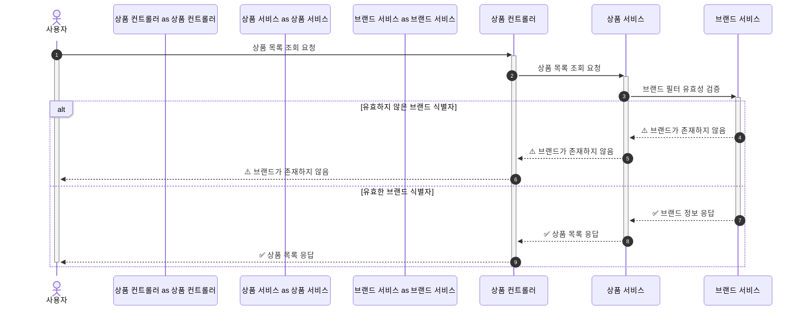
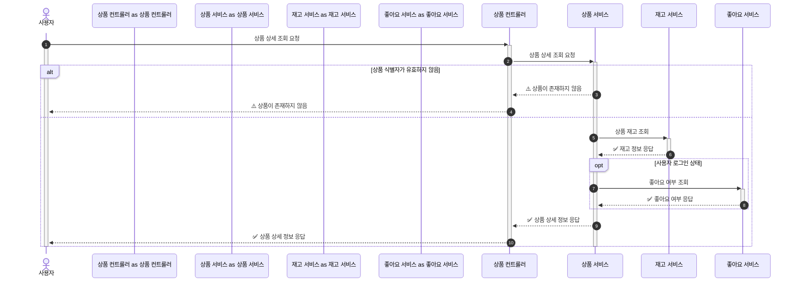
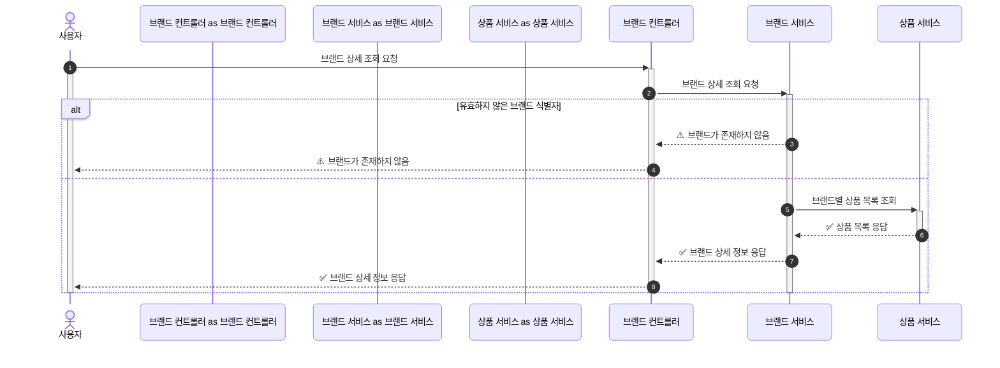
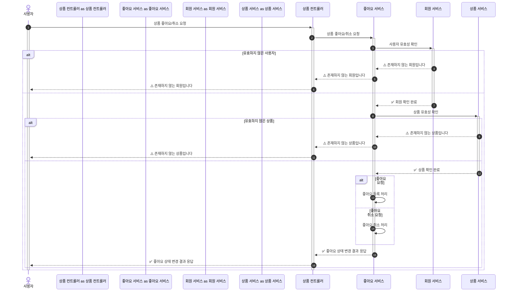
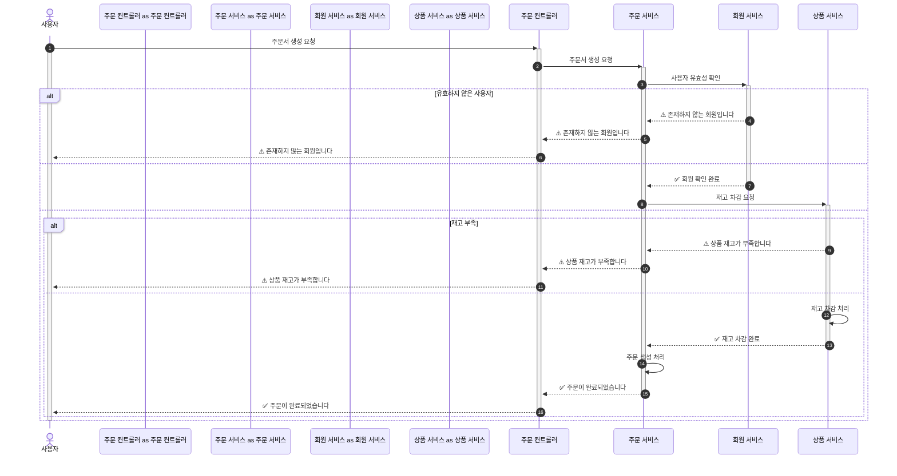
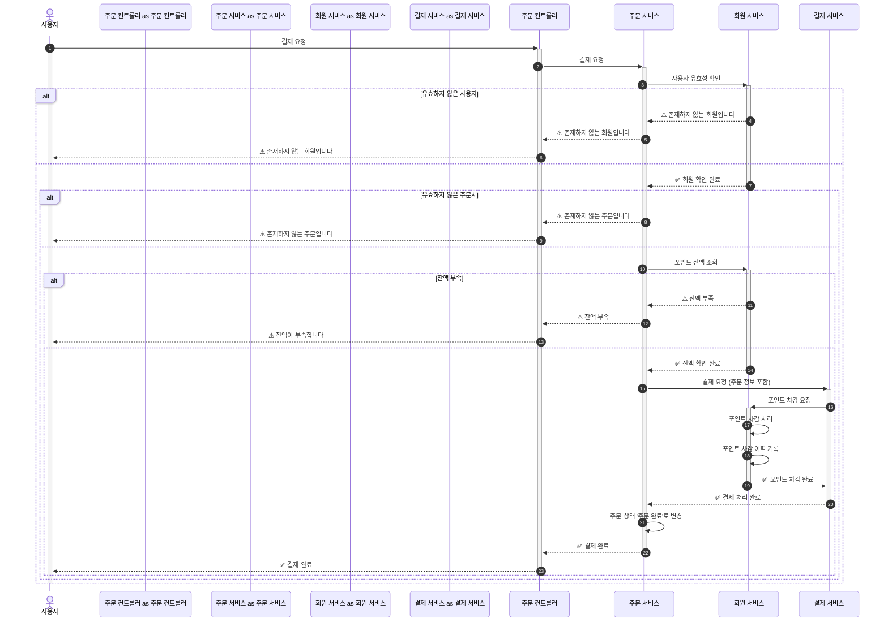

## 상품 목록 조회

---

```mermaid
---
config:
  look: neo
  theme: default
---
sequenceDiagram
  autonumber
  actor 사용자 as 사용자
  participant 상품 컨트롤러 as 상품 컨트롤러
  participant 상품 서비스 as 상품 서비스
  participant 브랜드 서비스 as 브랜드 서비스

  사용자 ->> 상품 컨트롤러: 상품 목록 조회 요청
  activate 사용자
  activate 상품 컨트롤러

  상품 컨트롤러 ->> 상품 서비스: 상품 목록 조회 요청
  activate 상품 서비스

  상품 서비스 ->> 브랜드 서비스: 브랜드 필터 유효성 검증
  activate 브랜드 서비스

  alt 유효하지 않은 브랜드 식별자
    브랜드 서비스 -->> 상품 서비스: ⚠️ 브랜드가 존재하지 않음
    상품 서비스 -->> 상품 컨트롤러: ⚠️ 브랜드가 존재하지 않음
    상품 컨트롤러 -->> 사용자: ⚠️ 브랜드가 존재하지 않음
  else 유효한 브랜드 식별자
    브랜드 서비스 -->> 상품 서비스: ✅ 브랜드 정보 응답
      deactivate 브랜드 서비스
    상품 서비스 -->> 상품 컨트롤러: ✅ 상품 목록 응답
      deactivate 상품 서비스
    상품 컨트롤러 -->> 사용자: ✅ 상품 목록 응답
      deactivate 상품 컨트롤러
      deactivate 사용자
  end

```

## 상품 상세

---

```mermaid
---
config:
  look: neo
  theme: default
---
sequenceDiagram
  autonumber
  actor 사용자 as 사용자
  participant 상품 컨트롤러 as 상품 컨트롤러
  participant 상품 서비스 as 상품 서비스
  participant 재고 서비스 as 재고 서비스
  participant 좋아요 서비스 as 좋아요 서비스

  사용자 ->> 상품 컨트롤러: 상품 상세 조회 요청
  activate 사용자
  activate 상품 컨트롤러

  상품 컨트롤러 ->> 상품 서비스: 상품 상세 조회 요청
  activate 상품 서비스

  alt 상품 식별자가 유효하지 않음
    상품 서비스 -->> 상품 컨트롤러: ⚠️ 상품이 존재하지 않음
    상품 컨트롤러 -->> 사용자: ⚠️ 상품이 존재하지 않음
  else
    상품 서비스 ->> 재고 서비스: 상품 재고 조회
    activate 재고 서비스
    재고 서비스 -->> 상품 서비스: ✅ 재고 정보 응답
    deactivate 재고 서비스

    opt 사용자 로그인 상태
      상품 서비스 ->> 좋아요 서비스: 좋아요 여부 조회
      activate 좋아요 서비스
      좋아요 서비스 -->> 상품 서비스: ✅ 좋아요 여부 응답
      deactivate 좋아요 서비스
    end

    상품 서비스 -->> 상품 컨트롤러: ✅ 상품 상세 정보 응답
    상품 컨트롤러 -->> 사용자: ✅ 상품 상세 정보 응답
  end

  deactivate 상품 서비스
  deactivate 상품 컨트롤러
  deactivate 사용자

```

## 브랜드 상세 조회

---

```mermaid
---
config:
  look: neo
  theme: default
---
sequenceDiagram
  autonumber
  actor 사용자 as 사용자
  participant 브랜드 컨트롤러 as 브랜드 컨트롤러
  participant 브랜드 서비스 as 브랜드 서비스
  participant 상품 서비스 as 상품 서비스

  사용자 ->> 브랜드 컨트롤러: 브랜드 상세 조회 요청
  activate 사용자
  activate 브랜드 컨트롤러

  브랜드 컨트롤러 ->> 브랜드 서비스: 브랜드 상세 조회 요청
  activate 브랜드 서비스

  alt 유효하지 않은 브랜드 식별자
    브랜드 서비스 -->> 브랜드 컨트롤러: ⚠️ 브랜드가 존재하지 않음
    브랜드 컨트롤러 -->> 사용자: ⚠️ 브랜드가 존재하지 않음
  else
    브랜드 서비스 ->> 상품 서비스: 브랜드별 상품 목록 조회
    activate 상품 서비스
    상품 서비스 -->> 브랜드 서비스: ✅ 상품 목록 응답
    deactivate 상품 서비스

    브랜드 서비스 -->> 브랜드 컨트롤러: ✅ 브랜드 상세 정보 응답
    브랜드 컨트롤러 -->> 사용자: ✅ 브랜드 상세 정보 응답
  end

  deactivate 브랜드 서비스
  deactivate 브랜드 컨트롤러
	deactivate 사용자
```

## **상품 좋아요**

---

```mermaid
---
config:
  look: neo
  theme: default
---
sequenceDiagram
  autonumber
  actor 사용자 as 사용자
  participant 상품 컨트롤러 as 상품 컨트롤러
  participant 좋아요 서비스 as 좋아요 서비스
  participant 회원 서비스 as 회원 서비스
  participant 상품 서비스 as 상품 서비스

  사용자 ->> 상품 컨트롤러: 상품 좋아요/취소 요청
  activate 사용자
  activate 상품 컨트롤러

  상품 컨트롤러 ->> 좋아요 서비스: 상품 좋아요/취소 요청
  activate 좋아요 서비스

  좋아요 서비스 ->> 회원 서비스: 사용자 유효성 확인
  activate 회원 서비스

  alt 유효하지 않은 사용자
    회원 서비스 -->> 좋아요 서비스: ⚠️ 존재하지 않는 회원입니다
    좋아요 서비스 -->> 상품 컨트롤러: ⚠️ 존재하지 않는 회원입니다
    상품 컨트롤러 -->> 사용자: ⚠️ 존재하지 않는 회원입니다
  else
    회원 서비스 -->> 좋아요 서비스: ✅ 회원 확인 완료
    deactivate 회원 서비스

    좋아요 서비스 ->> 상품 서비스: 상품 유효성 확인
    activate 상품 서비스

    alt 유효하지 않은 상품
      상품 서비스 -->> 좋아요 서비스: ⚠️ 존재하지 않는 상품입니다
      좋아요 서비스 -->> 상품 컨트롤러: ⚠️ 존재하지 않는 상품입니다
      상품 컨트롤러 -->> 사용자: ⚠️ 존재하지 않는 상품입니다
    else
      상품 서비스 -->> 좋아요 서비스: ✅ 상품 확인 완료
      deactivate 상품 서비스
      alt 좋아요 요청
        좋아요 서비스 ->> 좋아요 서비스: 좋아요 등록 처리
      else 좋아요 취소 요청
        좋아요 서비스 ->> 좋아요 서비스: 좋아요 취소 처리
      end

      좋아요 서비스 -->> 상품 컨트롤러: ✅ 좋아요 상태 변경 결과 응답
      deactivate 좋아요 서비스
      상품 컨트롤러 -->> 사용자: ✅ 좋아요 상태 변경 결과 응답
    end
  end
  deactivate 상품 컨트롤러
  deactivate 사용자

```

## 주문 생성

---

```mermaid
---
config:
  look: neo
  theme: default
---
sequenceDiagram
  autonumber
  actor 사용자 as 사용자
  participant 주문 컨트롤러 as 주문 컨트롤러
  participant 주문 서비스 as 주문 서비스
  participant 회원 서비스 as 회원 서비스
  participant 상품 서비스 as 상품 서비스

  사용자 ->> 주문 컨트롤러: 주문서 생성 요청
  activate 사용자
  activate 주문 컨트롤러

  주문 컨트롤러 ->> 주문 서비스: 주문서 생성 요청
  activate 주문 서비스

  주문 서비스 ->> 회원 서비스: 사용자 유효성 확인
  activate 회원 서비스

  alt 유효하지 않은 사용자
    회원 서비스 -->> 주문 서비스: ⚠️ 존재하지 않는 회원입니다
    주문 서비스 -->> 주문 컨트롤러: ⚠️ 존재하지 않는 회원입니다
    주문 컨트롤러 -->> 사용자: ⚠️ 존재하지 않는 회원입니다
  else
    회원 서비스 -->> 주문 서비스: ✅ 회원 확인 완료
    deactivate 회원 서비스

    주문 서비스 ->> 상품 서비스: 재고 차감 요청
    activate 상품 서비스

    else
      alt 재고 부족
        상품 서비스 -->> 주문 서비스: ⚠️ 상품 재고가 부족합니다
        주문 서비스 -->> 주문 컨트롤러: ⚠️ 상품 재고가 부족합니다
        주문 컨트롤러 -->> 사용자: ⚠️ 상품 재고가 부족합니다
      else

        상품 서비스 ->> 상품 서비스: 재고 차감 처리
        상품 서비스 -->> 주문 서비스: ✅ 재고 차감 완료
        deactivate 상품 서비스

        주문 서비스 ->> 주문 서비스: 주문 생성 처리
        주문 서비스 -->> 주문 컨트롤러: ✅ 주문이 완료되었습니다
         deactivate 주문 서비스
        주문 컨트롤러 -->> 사용자: ✅ 주문이 완료되었습니다
        deactivate 주문 컨트롤러
      end
  end
   deactivate 사용자

```

## **결제 처리**

---

```mermaid
---
config:
  look: neo
  theme: default
---
sequenceDiagram
  autonumber
  actor 사용자 as 사용자
  participant 주문 컨트롤러 as 주문 컨트롤러
  participant 주문 서비스 as 주문 서비스
  participant 회원 서비스 as 회원 서비스
  participant 결제 서비스 as 결제 서비스

  사용자 ->> 주문 컨트롤러: 결제 요청
  activate 사용자
  activate 주문 컨트롤러

  주문 컨트롤러 ->> 주문 서비스: 결제 요청
  activate 주문 서비스

  주문 서비스 ->> 회원 서비스: 사용자 유효성 확인
  activate 회원 서비스

  alt 유효하지 않은 사용자
    회원 서비스 -->> 주문 서비스: ⚠️ 존재하지 않는 회원입니다
    주문 서비스 -->> 주문 컨트롤러: ⚠️ 존재하지 않는 회원입니다
    주문 컨트롤러 -->> 사용자: ⚠️ 존재하지 않는 회원입니다
  else
    회원 서비스 -->> 주문 서비스: ✅ 회원 확인 완료
    deactivate 회원 서비스

    alt 유효하지 않은 주문서
      주문 서비스 -->> 주문 컨트롤러: ⚠️ 존재하지 않는 주문입니다
      주문 컨트롤러 -->> 사용자: ⚠️ 존재하지 않는 주문입니다
    else
      주문 서비스 ->> 회원 서비스: 포인트 잔액 조회
      activate 회원 서비스

      alt 잔액 부족
        회원 서비스 -->> 주문 서비스: ⚠️ 잔액 부족
        주문 서비스 -->> 주문 컨트롤러: ⚠️ 잔액 부족
        주문 컨트롤러 -->> 사용자: ⚠️ 잔액이 부족합니다
      else
        회원 서비스 -->> 주문 서비스: ✅ 잔액 확인 완료
        deactivate 회원 서비스

        주문 서비스 ->> 결제 서비스: 결제 요청 (주문 정보 포함)
        activate 결제 서비스

        결제 서비스 ->> 회원 서비스: 포인트 차감 요청
        activate 회원 서비스

        회원 서비스 ->> 회원 서비스: 포인트 차감 처리
        회원 서비스 ->> 회원 서비스: 포인트 차감 이력 기록
        회원 서비스 -->> 결제 서비스: ✅ 포인트 차감 완료
        deactivate 회원 서비스

        결제 서비스 -->> 주문 서비스: ✅ 결제 처리 완료
        deactivate 결제 서비스

        주문 서비스 ->> 주문 서비스: 주문 상태 '주문 완료'로 변경
        주문 서비스 -->> 주문 컨트롤러: ✅ 결제 완료
         deactivate 주문 서비스
        주문 컨트롤러 -->> 사용자: ✅ 결제 완료
          deactivate 주문 컨트롤러
      end
    end
  end

 deactivate 사용자

```