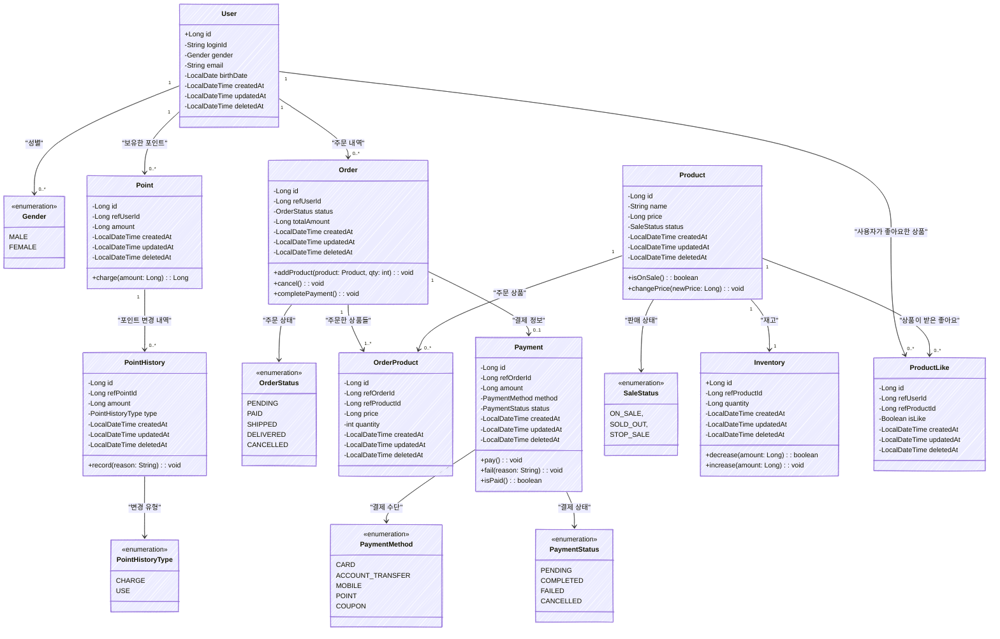

## 클래스 다이어그램

```mermaid
---
config:
  theme: default
  look: handDrawn
---
classDiagram
class User {
  +Long id
  -String loginId
  -Gender gender
  -String email
  -LocalDate birthDate
  -LocalDateTime createdAt
  -LocalDateTime updatedAt
  -LocalDateTime deletedAt
}
class Gender {
   <<enumeration>>
  MALE
  FEMALE
}
class Point {
  -Long id
  -Long refUserId
  -Long amount
  -LocalDateTime createdAt
  -LocalDateTime updatedAt
  -LocalDateTime deletedAt
  +charge(amount: Long): Long
}
class PointHistory {
  -Long id
  -Long refPointId
  -Long amount
  -PointHistoryType type
  -LocalDateTime createdAt
  -LocalDateTime updatedAt
  -LocalDateTime deletedAt
  +record(reason: String): void
}
class PointHistoryType {
  <<enumeration>>
  CHARGE
  USE
}
class Order {
  -Long id
  -Long refUserId
  -OrderStatus status
  -Long totalAmount
  -LocalDateTime createdAt
  -LocalDateTime updatedAt
  -LocalDateTime deletedAt
  +addProduct(product: Product, qty: int): void
  +cancel(): void
  +completePayment(): void
}
class OrderStatus {
  <<enumeration>>
  PENDING
  PAID
  SHIPPED
  DELIVERED
  CANCELLED
}
class OrderProduct {
  -Long id
  -Long refOrderId
  -Long refProductId
  -Long price
  -int quantity
  -LocalDateTime createdAt
  -LocalDateTime updatedAt
  -LocalDateTime deletedAt
}
class Payment {
  -Long id
  -Long refOrderId
  -Long amount
  -PaymentMethod method
  -PaymentStatus status
  -LocalDateTime createdAt
  -LocalDateTime updatedAt
  -LocalDateTime deletedAt
  +pay(): void
  +fail(reason: String): void
  +isPaid(): boolean
}
class PaymentMethod {
  <<enumeration>>
  CARD
  ACCOUNT_TRANSFER
  MOBILE
  POINT
  COUPON
}
class PaymentStatus {
  <<enumeration>>
  PENDING
  COMPLETED
  FAILED
  CANCELLED
}
class Product {
  -Long id
  -String name
  -Long price
  -SaleStatus status
  -LocalDateTime createdAt
  -LocalDateTime updatedAt
  -LocalDateTime deletedAt
  +isOnSale(): boolean
  +changePrice(newPrice: Long): void
}
class SaleStatus {
  <<enumeration>>
  	ON_SALE,   
    SOLD_OUT, 
    STOP_SALE  
}
class Inventory {
  +Long id
  -Long refProductId
  -Long quantity
  -LocalDateTime createdAt
  -LocalDateTime updatedAt
  -LocalDateTime deletedAt
  +decrease(amount: Long): boolean
  +increase(amount: Long): void
}
class ProductLike {
  -Long id
  -Long refUserId
  -Long refProductId
  -Boolean isLike
  -LocalDateTime createdAt
  -LocalDateTime updatedAt
  -LocalDateTime deletedAt
}
User "1" --> "0..*" Point : "보유한 포인트"
User "1" --> "0..*" Gender : "성별"
Point "1" --> "0..*" PointHistory : "포인트 변경 내역"
PointHistory --> PointHistoryType : "변경 유형"
User "1" --> "0..*" Order : "주문 내역"
Order "1" --> "0..1" Payment : "결제 정보"
Order --> OrderStatus : "주문 상태"
Order "1" --> "1..*" OrderProduct : "주문한 상품들"
Payment --> PaymentMethod : "결제 수단"
Payment --> PaymentStatus : "결제 상태"
User "1" --> "0..*" ProductLike : "사용자가 좋아요한 상품"
Product "1" --> "0..*" ProductLike : "상품이 받은 좋아요"
Product --> SaleStatus : "판매 상태"
Product "1" --> "1" Inventory : "재고"
Product "1" --> "0..*" OrderProduct : "주문 상품"

```