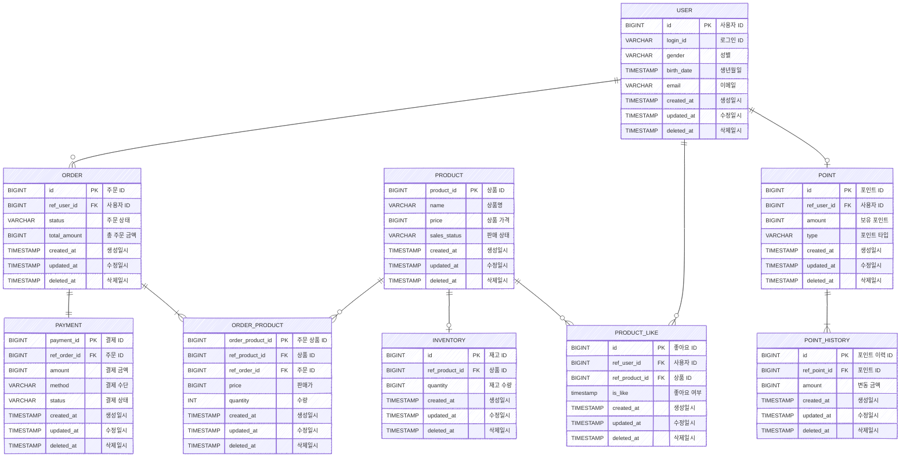

# ERD

```mermaid
---
config:
  theme: default
  layout: dagre
  look: handDrawn
---
erDiagram
    USER ||--o| POINT: ""
    POINT ||--|{ POINT_HISTORY: ""
    USER ||--o{ PRODUCT_LIKE: ""
    PRODUCT ||--o{ PRODUCT_LIKE: ""
    PRODUCT ||--o| INVENTORY: ""
    PRODUCT ||--o{ ORDER_PRODUCT: ""
    USER ||--o{ ORDER: ""
    ORDER ||--|{ ORDER_PRODUCT: ""
    ORDER ||--|| PAYMENT: ""
    USER {
        BIGINT id PK "사용자 ID"
        VARCHAR login_id "로그인 ID"
        VARCHAR gender "성별"
        TIMESTAMP birth_date "생년월일"
        VARCHAR email "이메일"
        TIMESTAMP created_at "생성일시"
        TIMESTAMP updated_at "수정일시"
        TIMESTAMP deleted_at "삭제일시"
    }
    POINT {
        BIGINT id PK "포인트 ID"
        BIGINT ref_user_id FK "사용자 ID"
        BIGINT amount "보유 포인트"
        VARCHAR type "포인트 타입"
        TIMESTAMP created_at "생성일시"
        TIMESTAMP updated_at "수정일시"
        TIMESTAMP deleted_at "삭제일시"
    }
    POINT_HISTORY {
        BIGINT id PK "포인트 이력 ID"
        BIGINT ref_point_id FK "포인트 ID"
        BIGINT amount "변동 금액"
        TIMESTAMP created_at "생성일시"
        TIMESTAMP updated_at "수정일시"
        TIMESTAMP deleted_at "삭제일시"
    }
    PRODUCT {
        BIGINT product_id PK "상품 ID"
        VARCHAR name "상품명"
        BIGINT price "상품 가격"
        VARCHAR sales_status "판매 상태"
        TIMESTAMP created_at "생성일시"
        TIMESTAMP updated_at "수정일시"
        TIMESTAMP deleted_at "삭제일시"
    }
    INVENTORY {
        BIGINT id PK "재고 ID"
        BIGINT ref_product_id FK "상품 ID"
        BIGINT quantity "재고 수량"
        TIMESTAMP created_at "생성일시"
        TIMESTAMP updated_at "수정일시"
        TIMESTAMP deleted_at "삭제일시"
    }
    ORDER {
        BIGINT id PK "주문 ID"
        BIGINT ref_user_id FK "사용자 ID"
        VARCHAR status "주문 상태"
        BIGINT total_amount "총 주문 금액"
        TIMESTAMP created_at "생성일시"
        TIMESTAMP updated_at "수정일시"
        TIMESTAMP deleted_at "삭제일시"
    }
    ORDER_PRODUCT {
        BIGINT order_product_id PK "주문 상품 ID"
        BIGINT ref_product_id FK "상품 ID"
        BIGINT ref_order_id FK "주문 ID"
        BIGINT price "판매가"
        INT quantity "수량"
        TIMESTAMP created_at "생성일시"
        TIMESTAMP updated_at "수정일시"
        TIMESTAMP deleted_at "삭제일시"
    }
    PAYMENT {
        BIGINT payment_id PK "결제 ID"
        BIGINT ref_order_id FK "주문 ID"
        BIGINT amount "결제 금액"
        VARCHAR method "결제 수단"
        VARCHAR status "결제 상태"
        TIMESTAMP created_at "생성일시"
        TIMESTAMP updated_at "수정일시"
        TIMESTAMP deleted_at "삭제일시"
    }
    PRODUCT_LIKE {
		BIGINT id PK "좋아요 ID"
		BIGINT ref_user_id FK "사용자 ID"
        BIGINT ref_product_id FK "상품 ID"
		timestamp is_like "좋아요 여부"
		TIMESTAMP created_at "생성일시"
        TIMESTAMP updated_at "수정일시"
        TIMESTAMP deleted_at "삭제일시"
	}

```