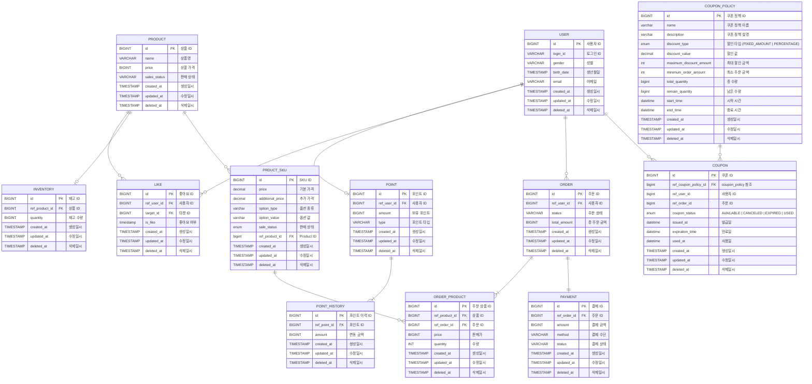

# ERD

```mermaid
---
---
config:
theme: default
layout: dagre
look: classic
---
erDiagram
    USER ||--o| POINT: ""
    POINT ||--|{ POINT_HISTORY: ""
    USER ||--o{ LIKE: ""
    PRODUCT ||--o{ LIKE: ""
    PRODUCT ||--o| INVENTORY: ""
    PRDUCT_SKU ||--o{ ORDER_PRODUCT: ""
    PRODUCT ||--o{ PRDUCT_SKU : ""
    USER ||--o{ ORDER: ""
    ORDER ||--|{ ORDER_PRODUCT: ""
    ORDER ||--|| PAYMENT: ""
    COUPON_POLICY ||--o{ COUPON : ""
    USER ||--o{ COUPON: ""
    USER {
        BIGINT id PK "사용자 ID"
        VARCHAR login_id "로그인 ID"
        VARCHAR gender "성별"
        TIMESTAMP birth_date "생년월일"
        VARCHAR email "이메일"
        TIMESTAMP created_at "생성일시"
        TIMESTAMP updated_at "수정일시"
        TIMESTAMP deleted_at "삭제일시"
    }
    POINT {
        BIGINT id PK "포인트 ID"
        BIGINT ref_user_id FK "사용자 ID"
        BIGINT amount "보유 포인트"
        VARCHAR type "포인트 타입"
        TIMESTAMP created_at "생성일시"
        TIMESTAMP updated_at "수정일시"
        TIMESTAMP deleted_at "삭제일시"
    }
    POINT_HISTORY {
        BIGINT id PK "포인트 이력 ID"
        BIGINT ref_point_id FK "포인트 ID"
        BIGINT amount "변동 금액"
        TIMESTAMP created_at "생성일시"
        TIMESTAMP updated_at "수정일시"
        TIMESTAMP deleted_at "삭제일시"
    }
    PRODUCT {
        BIGINT id PK "상품 ID"
        VARCHAR name "상품명"
        BIGINT price "상품 가격"
        VARCHAR sales_status "판매 상태"
        TIMESTAMP created_at "생성일시"
        TIMESTAMP updated_at "수정일시"
        TIMESTAMP deleted_at "삭제일시"
    }
    INVENTORY {
        BIGINT id PK "재고 ID"
        BIGINT ref_product_id FK "상품 ID"
        BIGINT quantity "재고 수량"
        TIMESTAMP created_at "생성일시"
        TIMESTAMP updated_at "수정일시"
        TIMESTAMP deleted_at "삭제일시"
    }
    ORDER {
        BIGINT id PK "주문 ID"
        BIGINT ref_user_id FK "사용자 ID"
        VARCHAR status "주문 상태"
        BIGINT total_amount "총 주문 금액"
        TIMESTAMP created_at "생성일시"
        TIMESTAMP updated_at "수정일시"
        TIMESTAMP deleted_at "삭제일시"
    }
    ORDER_PRODUCT {
        BIGINT id PK "주문 상품 ID"
        BIGINT ref_product_id FK "상품 ID"
        BIGINT ref_order_id FK "주문 ID"
        BIGINT price "판매가"
        INT quantity "수량"
        TIMESTAMP created_at "생성일시"
        TIMESTAMP updated_at "수정일시"
        TIMESTAMP deleted_at "삭제일시"
    }
    PAYMENT {
        BIGINT id PK "결제 ID"
        BIGINT ref_order_id FK "주문 ID"
        BIGINT amount "결제 금액"
        VARCHAR method "결제 수단"
        VARCHAR status "결제 상태"
        TIMESTAMP created_at "생성일시"
        TIMESTAMP updated_at "수정일시"
        TIMESTAMP deleted_at "삭제일시"
    }
    LIKE {
		BIGINT id PK "좋아요 ID"
		BIGINT ref_user_id FK "사용자 ID"
        BIGINT target_id FK "타겟 ID"
		timestamp is_like "좋아요 여부"
		TIMESTAMP created_at "생성일시"
        TIMESTAMP updated_at "수정일시"
        TIMESTAMP deleted_at "삭제일시"
	}
    PRDUCT_SKU {
        BIGINT id PK "SKU ID"
        decimal price "기본 가격"
        decimal additional_price "추가 가격"
        varchar option_type "옵션 종류"
        varchar option_value "옵션 값"
        enum sale_status "판매 상태"
        bigint ref_product_id FK "Product ID"
         TIMESTAMP created_at "생성일시"
        TIMESTAMP updated_at "수정일시"
        TIMESTAMP deleted_at "삭제일시"
    }
    COUPON_POLICY {
        BIGINT id PK "쿠폰 정책 ID"
        varchar name "쿠폰 정책 이름"
        varchar description "쿠폰 정책 설명"
        enum discount_type "할인 타입 (FIXED_AMOUNT | PERCENTAGE)"
        decimal discount_value "할인 값"
        int maximum_discount_amount "최대 할인 금액"
        int minimum_order_amount "최소 주문 금액"
        bigint total_quantity "총 수량"
        bigint remain_quantity "남은 수량"
        datetime start_time "시작 시간"
        datetime end_time "종료 시간"
        TIMESTAMP created_at "생성일시"
        TIMESTAMP updated_at "수정일시"
        TIMESTAMP deleted_at "삭제일시"
    }
    COUPON {
        BIGINT id PK "쿠폰 ID"
        bigint ref_coupon_policy_id FK "coupon_policy 참조"
        bigint ref_user_id "사용자 ID"
        bigint ref_order_id "주문 ID"
        enum coupon_status "AVAILABLE | CANCELED | EXPIRED | USED"
        datetime issued_at "발급일"
        datetime expiration_time "만료일"
        datetime used_at "사용일"
        TIMESTAMP created_at "생성일시"
        TIMESTAMP updated_at "수정일시"
        TIMESTAMP deleted_at "삭제일시" 
    }


```